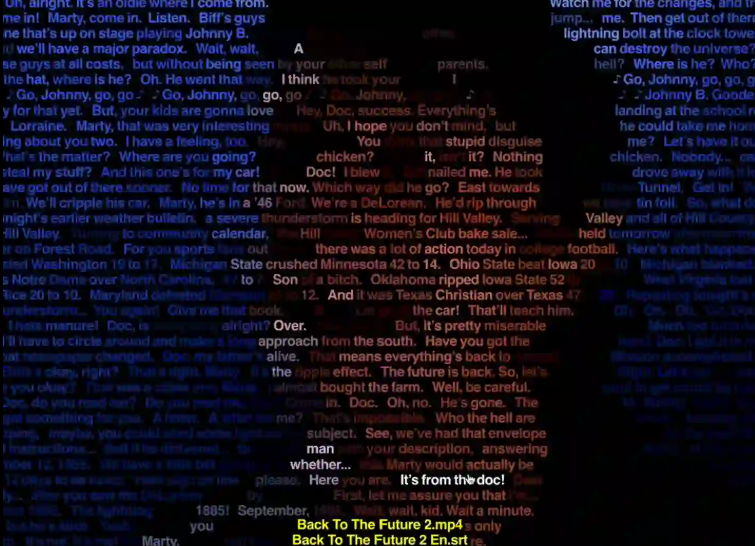
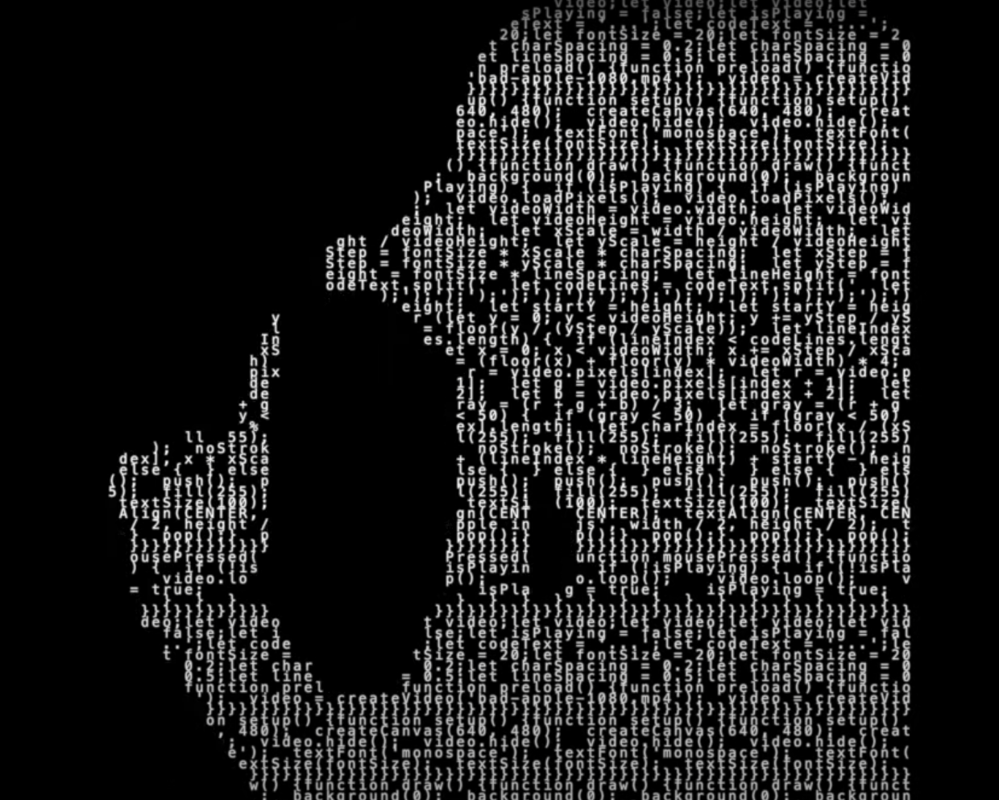
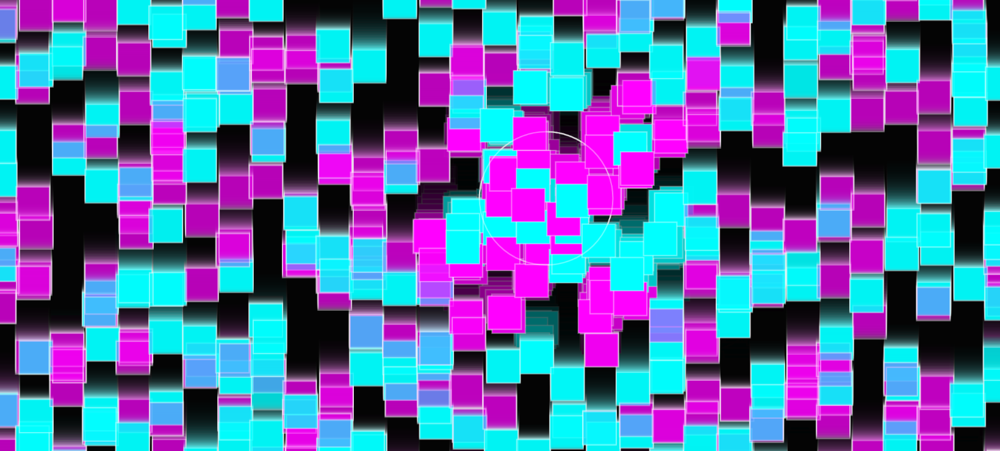
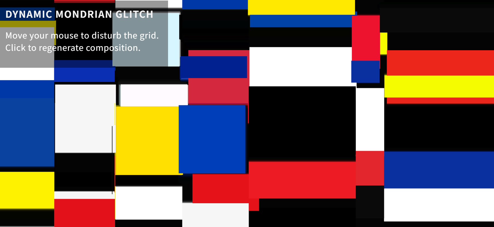
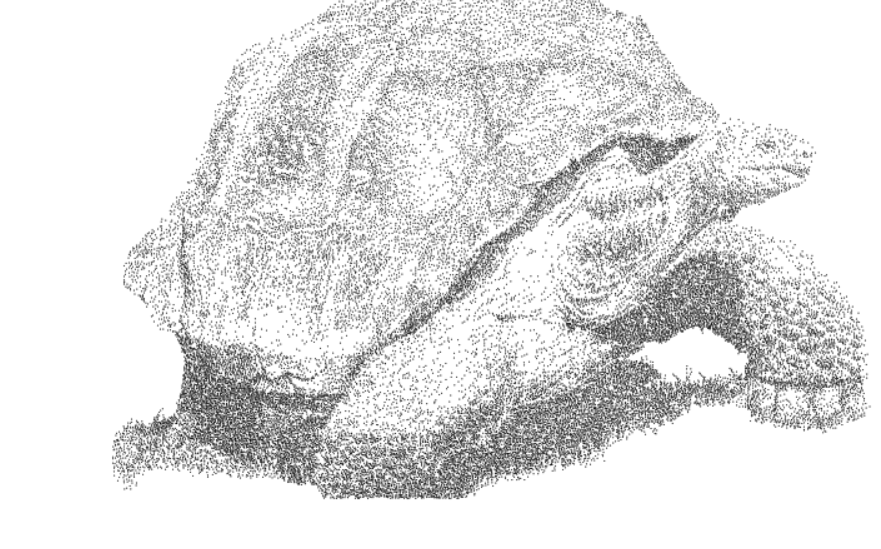

# dgao0048_9103_tut1Inspired by the style of the website, especially its CRT scan lines, color channel misalignment and pixel distortion digital glitch aesthetics, this technique has a distinct innovative application in digital deconstruction. Through the visual language of technical glitches and flowing graphics or text, dynamic images of positive and negative shapes can be presented, transforming the project works into **"digitized"** and reconstructed ones in the digital age. Thus, it not only reveals the preservation, circulation and variation of classic works in the contemporary media context, but also endows them with a new and critical interpretation of the times.

### Reference linking
- Website:
[Website 1](https://srt.ksawerykomputery.pl)
[Website 2](http://xhslink.com/o/3e17CX2SjZw)

- Screenshots :

## Part 2: Coding Technique Exploration

This is achieved by deliberately damaging or disrupting the binary data of the image. This effect is not achieved through traditional image filters, but by directly manipulating the underlying byte data of the image file. The core principle of this effect is: treating the image file as pure text or binary data, then destroying its structure in a specific way, and then using the image viewer to **"fix"** these errors, thereby generating unpredictable and artistically pleasing visual glitches.

- Website:
[Example implementation 1](http://127.0.0.1:5501/glitch_effect/index.html)
[Example implementation 2](https://openprocessing.org/sketch/2219978/#code)

- Screenshots :

